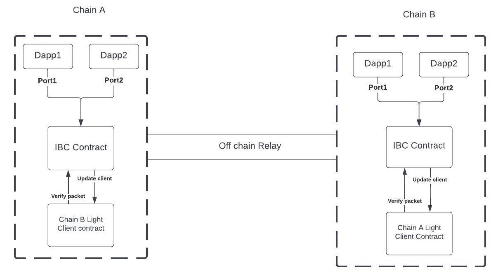

# IBC: Inter-Blockchain Communication Protocol

The **Inter-Blockchain Communication (IBC)** protocol serves as a bridge between disparate blockchains, enabling seamless communication and data transfer. To delve into the specifications of IBC, you can refer to the [official documentation](https://github.com/cosmos/ibc/tree/main/spec). Additionally, for its practical implementation, you'll find the codebase at [this repository](https://github.com/cosmos/ibc-go).

While IBC is integral to the Cosmos ecosystem, it's important to note that native chains within Cosmos leverage the IBC native module, a functionality that isn't directly applicable to blockchains outside the Cosmos framework.

## IBC Integration using Smart Contracts

In order to connect non-cosmos based chain we have implemented IBC specs in smart contacts. This repo contains [smart contracts](https://github.com/icon-project/IBC-Integration/tree/main/contracts) developed in both javascore (for ICON blockchain) and CosmWasm (for Cosmos ecosystem chains). These contracts are accompanied by their respective light clients, which are essential for efficient cross-chain communication. The CosmWasm contract is almost identical to the native specs, and the deviations of the Javascore smart contract for the ICON chain are detailed in this [link](https://github.com/icon-project/IBC-Integration/blob/main/docs/adr/ICON-lightclient.md).

The [Tendermint light client](https://github.com/cosmos/ibc/tree/main/spec/client/ics-007-tendermint-client) has been implemented using Javascore and is available for reference [here](https://github.com/icon-project/IBC-Integration/tree/main/contracts/javascore/lightclients/tendermint). Similarly, you can find the specifications for the ICON light client [here](https://github.com/icon-project/IBC-Integration/blob/main/docs/adr/ICON-lightclient.md), with its implementation located [here](https://github.com/icon-project/IBC-Integration/tree/main/contracts/cosmwasm-vm/cw-icon-light-client). Figure below shows basic working of Ibc architecture. 

## Off-Chain Relay and Deviations

An off-chain relay is necessary to transfering IBC packets between chains. The Cosmos relayer has been forked to create the modules capable of handling ICON and CosmWasm contract, as detailed in this [repository](https://github.com/icon-project/ibc-relay). Deviations from the standard Cosmos relayer are documented [here](https://github.com/icon-project/ibc-relay/blob/main/docs/deviations_from_ibc.md).
