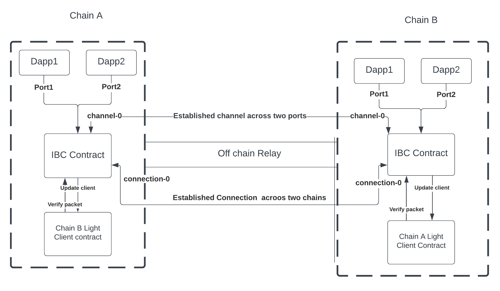

# IBC: Inter-Blockchain Communication Protocol

The **Inter-Blockchain Communication (IBC)** protocol serves as a bridge between disparate blockchains, enabling seamless communication and data transfer. To delve into the specifications of IBC, you can refer to the [official documentation](https://github.com/cosmos/ibc/tree/main/spec). Additionally, for its practical implementation, you'll find the codebase at [this repository](https://github.com/cosmos/ibc-go).

While IBC is integral to the Cosmos ecosystem, it's important to note that native chains within Cosmos leverage the IBC native module, a functionality that isn't directly applicable to blockchains outside the Cosmos framework.

## IBC Integration using Smart Contracts

In order to connect non-cosmos based chain we have implemented IBC specs in smart contacts. This repo contains [smart contracts](https://github.com/icon-project/IBC-Integration/tree/main/contracts) developed in both javascore (for ICON blockchain) and CosmWasm (for Cosmos ecosystem chains). These contracts are accompanied by their respective light clients, which are essential for efficient cross-chain communication. The CosmWasm contract is almost identical to the native specs, and the deviations of the Javascore smart contract for the ICON chain are detailed in this [link](https://github.com/icon-project/IBC-Integration/blob/main/docs/adr/ICON-lightclient.md).

The [Tendermint light client](https://github.com/cosmos/ibc/tree/main/spec/client/ics-007-tendermint-client) has been implemented in Javascore and is available for reference [here](https://github.com/icon-project/IBC-Integration/tree/main/contracts/javascore/lightclients/tendermint). While the Icon blockchain does not provide a provable store, we can send a BTP (Blockchain Transmission Protocol) message when a certain method executes and send proof of the message using the BTP block. A detailed description of this approach is provided in the specifications for the ICON light client, which can be found [here](https://github.com/icon-project/IBC-Integration/blob/main/docs/adr/ICON-lightclient.md). The actual implementation of the ICON light client is located [here](https://github.com/icon-project/IBC-Integration/tree/main/contracts/cosmwasm-vm/cw-icon-light-client).

## IBC Architecture Overview

The following figure illustrates the basic working of the IBC (Inter-Blockchain Communication) architecture.

### IBC Client

To enable seamless interaction between two blockchain networks, a counterparty client must be created on each chain. This client is responsible for creating a unique instance of a **client-id**, which is responsible verifying and updating the counterparty chain as a light client.

## Packet Flow and Semantics

The process of data transmission via packets requires the implementation of connection, channel, and port semantics. A comprehensive specification for these concepts is provided in detail [here](https://github.com/cosmos/ibc/tree/main/spec/core).

### Establishing IBC Connections

For linking two separate blockchains through IBC, the establishment of an IBC connection is necessary. This connection is formed through a four-way handshake process. Connections are established over a designated client and are denoted by **connection-id**.

### Application Modules, Ports and Channels

In the IBC framework, user-deployed modules, often referred to as applications or apps. These modules are uniquely identified by their respective ports known as **port-id**. In order to connect two applications, channel are created. Similar to the connection process, a channel also follows a four-way handshake process. These channels are formed over previously established connections and are known as **channel-id**. Packets are transfered over the combination of channel and port known as **capability**.

## Off-Chain Relay and Deviations

An off-chain relay is necessary to transfering IBC packets between blockchains. The Cosmos relayer has been forked to create the modules capable of handling ICON and CosmWasm contract, as detailed in this [repository](https://github.com/icon-project/ibc-relay). Deviations from the standard Cosmos relayer are documented [here](https://github.com/icon-project/ibc-relay/blob/main/docs/deviations_from_ibc.md).
