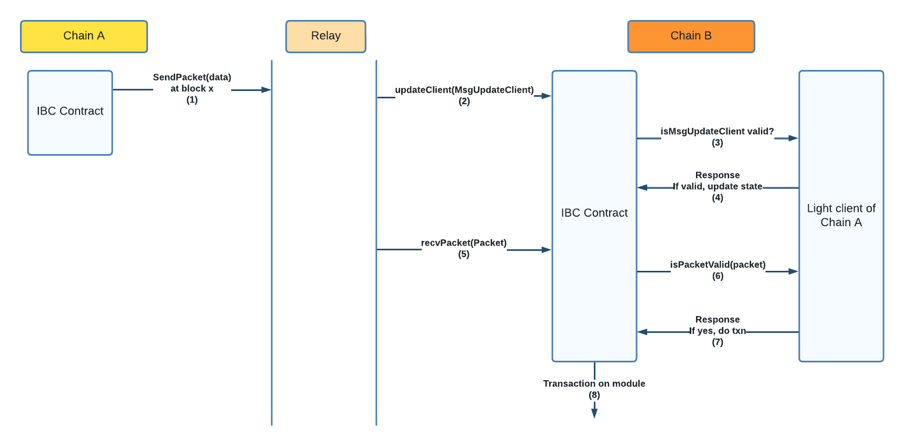

# Light Client Adr

## Introduction
This document describes the design to implement light client of a chain on other chain as a smart contract to be used for ICON-IBC.

## Terminologies

| Term | Definition                     | Link |
|:-----|:-------------------------------|:-----|
| IBC  | Inter Blockchain Communication | -    |
|


## Considerations
Light client will be a separate contract, which will be used for verification of packets before executing the transactions. This contract will not maintain states. The state is manitained on IBC Contract, based on IBC

1. On every IBC Transaction generated on a chain, the light client of counterparty chain is to be updated.
2. If there are few transactions, light client needs to be updated occasionally, even without IBC Transactions, so as to keep the light client active.
3. Light client contract will not store anything. It'll just be used to query the client/consensus state stored on IBC Core contract, and use that to verify incoming data.
4. It is mainly responsible for verifying the following things:
    - If the incoming data to update light client is a valid data and can be added to light client.
    - If the incoming packet of data is a valid packet and has not been tampered with, based on data the light client has.
5. The blocks stored does not have to be sequential. Incoming block should be considered valid based on a set of rules defined in the client state.


## Design


1. Incoming IBC Transaction on chain A. A eventlog is generated by IBC Contract on chain A at block x.
2. Relayer picks it up, and calls updateClient method with `MsgUpdateClient` about block x on IBC Contract of Chain B.
3. IBC Contract queries light client of chain A to verify if the incoming `MsgUpdateClient` is valid.
4. Light Client verifies if `MsgUpdateClient` is valid and returns a response. If valid, the consensus state of chain A corresponsing to block x is updated.
5. Relayer picks up the transaction and calls recvPacket() method with `Packet` data.
6. IBC Contract queries light client to check if it is a valid packet.
7. Light Client verifies it, and responds.
8. If valid, the transaction in the Packet is executed.

## Light Client Readonly Methods

Referenced from [TendermintLightClient.sol](https://github.com/datachainlab/tendermint-sol/blob/main/contracts/TendermintLightClient.sol). Might changed as required during development.

```go
func getTimestampAtHeight(){}
func getLatestHeight(){}
func checkHeaderAndUpdateState(){}
func checkValidity(){}
func verifyConnectionState(){}
func verifyChannelState(){}
func verifyPacketCommitment(){}
func verifyClientState(){}
func verifyClientConsensusState(){}
func getClientState(){}
func getConsensusState(){}
func verifyMembership(){}
```


### Reference Specification
1. [Tendermint-Light-Client](https://github.com/cosmos/ibc/blob/main/spec/client/ics-007-tendermint-client/README.md)

### Reference Implementations
1. [Tendermint-Client-Golang](https://github.com/cosmos/ibc-go/tree/main/modules/light-clients/07-tendermint)
2. [Tendermint-Client-Solidity](https://github.com/datachainlab/tendermint-sol/blob/main/contracts/TendermintLightClient.sol)
