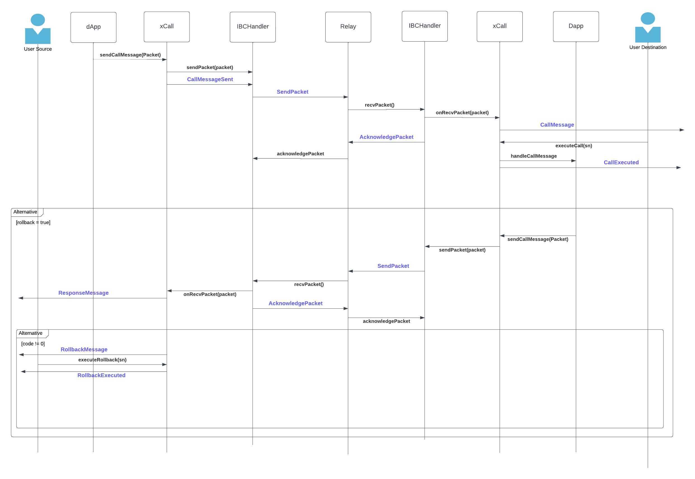

# XCall ADR

## Introduction

This document describes the design to implement xcall as IBC Module to support IBC.

## Terminologies

| Term  | Definition                       | Link                                                                     |
|:------|:---------------------------------|:-------------------------------------------------------------------------|
| xCall | Arbitrary Call Service           | [IIP52](https://github.com/icon-project/IIPs/blob/master/IIPS/iip-52.md) |
| IBC   | Inter Blockchain Communication   |                                                                          |
| BTP   | Blockchain Transmission Protocol |                                                                          |

## Considerations

XCall is an application level contract which does not need to know any complexities of IBC.
When relayer does a transaction on the destination chain, relayer need incur the cost required to execute the
transaction, which can get expensive for the relay.

On the xcall specification, relayer saves the transaction on destination chain. The user needs to execute the
transaction themselves, so the burden of transaction fee for transaction execution does not need to go to the relay.

This is a WIP, some specs might be changed later with the development. The logic for fees are not included in this
document and will be added later.

Cross-chain address refer to BTP Address (for now).

## Design

XCall is an application module to implement IBCModule interface. The xcall is defined
by [IIP52](https://github.com/icon-project/IIPs/blob/master/IIPS/iip-52.md). To be used in ICON-IBC, some specs
has been added to support IBC standards.

This was designed taking an example of IBC Module and xcall contract.

#### Implementations:

- [xcall](https://github.com/icon-project/btp/blob/iconloop-v2/solidity/xcall/contracts/CallService.sol)
- [IBC Module](https://github.com/hyperledger-labs/yui-ibc-solidity/blob/main/contracts/apps/20-transfer/ICS20Transfer.sol)

## Data Structures

### Constants

```go
const ( 
    CS_REQUEST = 1
    CS_RESPONSE = 2

    CS_RESP_SUCCESS = 0;
    CS_RESP_FAILURE = -1;
    CS_RESP_IBC_ERROR = -2;
)
```

### Structs:

```go
type CSMessageRequest struct {
	from address // cross-chain address of sender 
	to string // cross-chain address of receiver
	sn uint // sequence number
	rollback boolean // (Optional) if Rollback needed on source chain if call request fails on destination chain.
	data []byte
}

type CSMessage struct {
    msgType int 
    payload []byte
}

type CSMessageResponse struct {
	sn uint;
	code int;
	msg string;
}

type PacketData struct {
    sequence uint
    source_port string
    source_channel string
    destination_port string
    destination_channel string
    data []byte // CSMessageRequest while sending, CSMessage while receiving
    timeout_height Height // trusting period time; global variable set by admin
    timeout_timestamp uint
  }
```

### Flow Diagram



### Events

These events are to be used as per the specifications as defined in IIP 52.

#### 1. CallMessageSent(Address _from, String _to, BigInteger _sn, BigInteger _nsn)

#### 2. CallMessage(String _from, String _to, BigInteger _sn, BigInteger _reqId)

#### 3. RollbackMessage(sn)

#### 4. RollbackExecuted(BigInteger _sn, int _code, String _msg)

#### 5. CallExecuted(BigInteger _reqId, int _code, String _msg)

#### 6. ResponseMessage(BigInteger _sn, int _code, String _msg)

### Methods required

#### 1. SetDestinationChannelAndPort

```go
func setDestinationChannelAndPort(channel string, port string) {
	destination_port = port
	destination_channel = channel

}
```

#### 2. SetSourceChannelAndPort

Should be a private method, and set after OnChanOpenConfirm/Ack handshaking.

```go
func setSourceChannelAndPort(channel string, port string) {
	source_port = port
	source_channel = channel
}
```

### IBCModule and XCall Interface Methods:

#### 1. sendCallMessage

This method is called to send IBC message from one chain to another.
It generates a **CallMessageSent** eventlog.

```go
sendCallMessage(String _to, byte[] _data, @Optional byte[] _rollback);{
    sn = ibcHandler.getNextSequence()
    rollback = _rollback != nil
	PacketData d = {
		sequence: sn,
		source_port: source_port,
		source_channel: source_channel,
		destination_port: destination_port,
		data: CSMessageRequest({
			from: msg.sender,
			to: _to,
			sn: sn,
			rollback: rollback,
			data: _data
		}).toBytes()
		timeout_height: ..
		timeout_timestamp: 0
	}

	ibcHandler.sendPacket(d)
	CallMessageSent(from, to , sn, reqId)
}

```

The `_to` parameter is the cross-chain address of the callee contract which receives the `_data` payload on the
destination chain.

The `_data` parameter is an arbitrary payload defined by the DApp.

The `_rollback` parameter is for handling error cases, see Error Handling section below for details. Works as defined
on [IIP 52](https://github.com/icon-project/IIPs/blob/master/IIPS/iip-52.md).

When xcall on the source chain receives the call request message, it sends the `_data` to `_to` on the destination chain
through BTP/IBC.

#### 2. handleCallMessage

When the user calls executeCall method, the `xcall` invokes the following predefined method in the target DApp with the
`calldata` associated in _reqId.
This method is called by proxy contract.

```go
func handleCallMessage(_from string, _data []byte[]) {
}
```

If the call request was a one-way message and DApp on the destination chain needs to send back the result (or error), it
may call the same method interface (i.e. sendCallMessage) to send the result message to the caller. Then the user on the
source chain would be notified via CallMessage event, and call executeCall, then DApp on the source chain may process
the result in the handleCallMessage method.

#### 3. ExecuteCall

Executes transaction saved in reqId, as explained
in [IIP 52](https://github.com/icon-project/IIPs/blob/master/IIPS/iip-52.md#executecall)

```go
// executes transaction corresponding to requestId
func executeCall(reqId int) {
	CSMessageRequest msgReq = proxyReqs[reqId]
	// try executing transaction defined on msgReq as defined on IIP52.
}
```
Generates `CallExecuted` eventlog

#### 4. ExecuteRollback

Generates **RollbackExecuted** eventlog

```go
func executeRollback(sn int) {
	// same as IIP52
}
```

### 5. OnAcknowledgementPacket

This part ideally would be handled by handleResponse().

```go
func onAcknowledgementPacket (
	callData PacketData,
	acknowledgement []byte
) {

}
```

**The following are the channel handshaking interfaces as defined by IBCModule interface.
Referenced
from [yui-ibc-solidity](https://github.com/hyperledger-labs/yui-ibc-solidity/blob/main/contracts/core/05-port/IIBCModule.sol).
The implementation of these methods might change.**

```go
func onChanOpenInit(
        Channel.Order,
        connectionHops string[] ,
        portId string ,
        channelId string ,
        counterparty ChannelCounterparty.Data ,
        version string 
    ) {
    	// any logic, will be decided during development
    };
```

```go
func onChanOpenTry(
        Channel.Order,
        connectionHops string[],
        portId string,
        channelId string,
        counterparty ChannelCounterparty.Data,
        version string,
        counterpartyVersion string
    ) {

    }
```

```go
func onChanOpenAck(
	portId string, 
	channelId string, 
	counterpartyVersion string
) {

}
```

```go
 func onChanOpenConfirm(
 	portId string, 
 	channelId string
 ) {

 }
 ```

